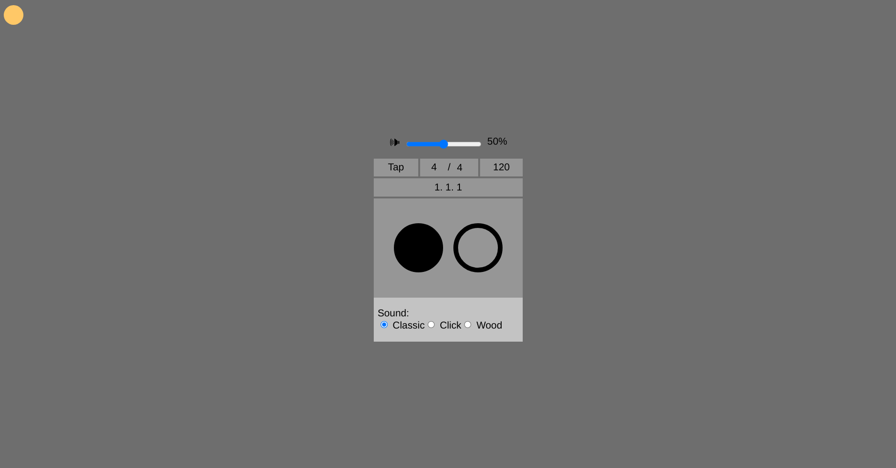
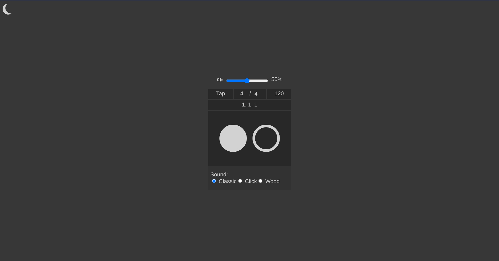

# ablm - The Online Metronome

**`NOTE`: This is a fork from [@franeklubi](https://github.com/franeklubi/ablm). I just added some features and fixed some bugs.**

The Ableton metronome's classic sound is the best, You can't prove me wrong.

But the hassle of starting up a VM with windows just to launch Ableton every time I want to play some piano almost makes me want to use other, clearly worse metronomes.

#### The obvious solution - make a web alternative

Introducing: ablm - The Online Metronome inspired by Ableton

# Features:

- All Ableton metronome's sounds
- **DARK MODE**, of course
- Live arrangement position, just like the real one
- Tap to set bpm
- Cool design, at least I think so
- Keybindings:
  - `T` - click on tap button
  - `D` - turn DarkMode on
  - `space` - start and stop the metronome

# How do I get started on using this masterpiece?

Just go [here](https://vian21.github.io/click/)

Have a great time!

Links:

- https://stackoverflow.com/questions/43794356/html5-volume-increase-past-100
